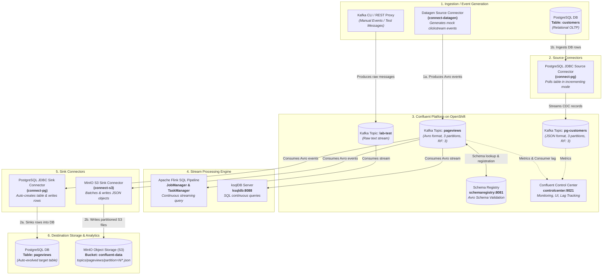

# Confluent for Kubernetes (CFK) on OpenShift

This directory contains step-by-step automation scripts and Custom Resource (CR) manifests to deploy and validate Confluent Platform on Red Hat OpenShift using the Confluent for Kubernetes (CFK) operator.

---

## End-to-End Data Flow Architecture

The following diagram illustrates how event streams and database changes flow through Confluent Platform, Kafka Connect clusters, Apache Flink, PostgreSQL, and MinIO S3 Object Storage within OpenShift:



### Flow Breakdown Summary

| Pipeline Flow | Source | Converter / Format | Kafka Topic | Target / Destination | Purpose |
| :--- | :--- | :--- | :--- | :--- | :--- |
| **Flow 1: Mock Stream Generation** | `connect-datagen` | `AvroConverter` + Schema Registry | `pageviews` | Kafka Brokers | Generates live mock clickstream data (`viewtime`, `userid`, `pageid`). |
| **Flow 2: PostgreSQL CDC Ingestion** | PostgreSQL `customers` table | `JsonConverter` | `pg-customers` | Kafka Brokers | Captures inserts/changes from relational database into event stream. |
| **Flow 3: Database Sink** | Kafka `pageviews` topic | `AvroConverter` + Schema Registry | `pageviews` | PostgreSQL `pageviews` table (`connect-pg`) | Reads stream and auto-creates/populates relational database table. |
| **Flow 4: Data Lake Sink (S3)** | Kafka `pageviews` topic | `AvroConverter` ➡️ `JsonFormat` | `pageviews` | MinIO S3 `confluent-data/` bucket (`connect-s3`) | Batches and writes partitioned S3 JSON object files for long-term lakehouse storage. |
| **Flow 5: Stream Compute** | Kafka `lab-test` & `pageviews` | Raw & Avro | `lab-test`, `pageviews` | Flink SQL & ksqlDB | Performs real-time transformations and streaming analytics. |

---

## Directory Structure

```text
cfk-openshift/
├── manifests/
│   ├── 01-kraftcontroller.yaml   # 3-replica KRaft Controller quorum
│   ├── 02-kafka.yaml             # 3-replica Kafka Brokers (KRaft mode)
│   ├── 03-schemaregistry.yaml    # 1-replica Confluent Schema Registry
│   ├── 04-connect-datagen.yaml   # Kafka Connect cluster dedicated for Datagen plugin
│   ├── 04-connect-pg.yaml        # Kafka Connect cluster dedicated for PostgreSQL (JDBC)
│   ├── 05-ksqldb.yaml            # 1-replica ksqlDB Server
│   ├── 06-controlcenter.yaml     # Control Center (linked to connect-datagen & connect-pg)
│   ├── 07-kafkarestproxy.yaml    # 1-replica Kafka REST Proxy + KafkaRestClass
│   ├── 08-connector-datagen.yaml # Connector CR for streaming mock pageviews (points to connect-datagen)
│   ├── 09-flink-cluster.yaml     # Apache Flink JobManager, TaskManager & Service
│   ├── 10-postgres.yaml          # PostgreSQL Database Deployment & Service
│   ├── 11-connector-postgres.yaml# Kafka Connect JDBC Source Connector CR (points to connect-pg)
│   ├── 12-connector-postgres-sink.yaml # Kafka Connect JDBC Sink Connector CR (pageviews -> PostgreSQL)
│   ├── 13-minio.yaml             # MinIO (S3 Object Storage) Deployment & Service
│   └── 14-connector-minio-sink.yaml    # Kafka Connect S3 Sink Connector CR (pageviews -> MinIO)
├── mcp_server/
│   └── server.py                 # FastMCP Server exposing CFK tools to AI agents
├── scripts/
│   ├── 00-oc-login.sh            # Auto-login to OpenShift using credentials from .env
│   ├── 01-prepare-cluster.sh     # Verify nodes, patch scheduler, create project & grant anyuid SCC
│   ├── 02-install-cfk-operator.sh# Helm repo add/update & CFK operator install
│   ├── 03-deploy-confluent-platform.sh # Apply CR manifests in order
│   ├── 04-expose-controlcenter.sh# Create OpenShift Edge Route for Control Center
│   ├── 05-test-produce-consume.sh# Topic creation, produce and consume verification
│   ├── 06-test-schema-registry.sh# Register Avro schema & verify versions via SR REST API
│   ├── 07-test-datagen-connect.sh# Deploy Datagen Connect cluster & stream mock pageviews
│   ├── 08-test-ksqldb.sh         # Create ksqlDB Stream & run real-time queries
│   ├── 09-deploy-flink.sh        # Deploy Flink Cluster and expose OpenShift Web UI Route
│   ├── 10-test-flink-sql.sh      # Execute continuous Flink SQL query against Kafka
│   ├── 11-test-postgres-connect.sh # Deploy PostgreSQL, seed data, run JDBC Source Connector
│   ├── 12-test-postgres-sink.sh  # Deploy JDBC Sink Connector & verify pageviews written to PostgreSQL
│   ├── 13-test-minio-s3.sh       # Deploy MinIO pod, create bucket, run S3 Sink & read S3 files
│   ├── produce-to-s3-and-db.sh   # Stream live events and inspect both MinIO files and PG table
│   ├── insert-postgres-data.sh   # Insert live records into PostgreSQL to test real-time streaming
│   ├── stop-connector.sh         # Stop and delete a Kafka Connect connector
│   ├── stop-all.sh               # Scale down all workloads to 0 replicas (saves compute, preserves data)
│   ├── start-all.sh              # Scale up all workloads back to normal
│   ├── cleanup-all.sh            # Complete teardown: deletes CRs, PVCs, Helm release & project
│   └── run-all.sh                # End-to-end execution runner
└── README.md
```

---

## Prerequisites

1. **CLI Tools**: Ensure `oc` (OpenShift CLI) and `helm` are installed.
2. **Cluster Access**: Logged in to your OpenShift cluster as cluster administrator (`kubeadmin`):
   ```bash
   oc login https://api.<cluster-domain>:6443 -u kubeadmin -p <password> --insecure-skip-tls-verify=true
   ```

---

## Quick Start (Run All)

To run the complete setup end-to-end:

```bash
chmod +x cfk-openshift/scripts/*.sh
./cfk-openshift/scripts/run-all.sh
```

---

## Step-by-Step Execution

### Step 1: Prepare the Cluster & Security

Prepares the OpenShift cluster by enabling master node scheduling (useful for small or managed clusters running ODF/monitoring), creating the `confluent` project, and granting the required `anyuid` SCC to the service accounts.

```bash
./cfk-openshift/scripts/01-prepare-cluster.sh
```

### Step 2: Install CFK Operator

Adds the Confluent Helm repository and installs the Confluent for Kubernetes operator in the `confluent` namespace.

```bash
./cfk-openshift/scripts/02-install-cfk-operator.sh
```

### Step 3: Deploy Confluent Platform

Applies the custom resources in sequence:
1. **KRaft Controller** (`01-kraftcontroller.yaml`)
2. **Kafka Brokers** (`02-kafka.yaml`)
3. **Schema Registry** (`03-schemaregistry.yaml`)
4. **Kafka Connect** (`04-connect.yaml`)
5. **ksqlDB** (`05-ksqldb.yaml`)
6. **Control Center** (`06-controlcenter.yaml`)
7. **Kafka REST Proxy & KafkaRestClass** (`07-kafkarestproxy.yaml`)

```bash
./cfk-openshift/scripts/03-deploy-confluent-platform.sh
```

### Step 4: Expose Control Center via OpenShift Route

Creates an Edge-terminated OpenShift Route on port 9021 with HTTP-to-HTTPS redirect.

```bash
./cfk-openshift/scripts/04-expose-controlcenter.sh
```

Open the printed route URL in your browser to access the Confluent Control Center web UI.

### Step 5: Test & Validate

Creates a 3-partition, 3-replica test topic (`lab-test`), produces a message, and consumes it back from `kafka-0`.

```bash
./cfk-openshift/scripts/05-test-produce-consume.sh
```

### Step 6: Schema Registry Validation

Registers an Avro schema (`PageViewEvent`) to `lab-pageviews-value` via Schema Registry REST API and retrieves the version details.

```bash
./cfk-openshift/scripts/06-test-schema-registry.sh
```

### Step 7: Kafka Connect Datagen (Mock Data Generation)

Deploys the dedicated `connect-datagen` cluster (`04-connect-datagen.yaml`) and the Datagen connector (`08-connector-datagen.yaml`) to generate mock pageviews into the `pageviews` topic.

```bash
./cfk-openshift/scripts/07-test-datagen-connect.sh
```

### Step 8: ksqlDB Real-Time Queries

Creates a continuous ksqlDB stream on the `pageviews` topic and runs an active query stream via the ksqlDB REST API.

```bash
./cfk-openshift/scripts/08-test-ksqldb.sh
```

### Step 9: Apache Flink Cluster Deployment

Deploys a Flink JobManager + TaskManager cluster (`09-flink-cluster.yaml`) and exposes an OpenShift Route for the Flink Web UI.

```bash
./cfk-openshift/scripts/09-deploy-flink.sh
```

### Step 10: Flink SQL Pipeline

Submits a real-time Flink SQL job connected directly to `kafka:9071` using the `flink-sql-connector-kafka` connector.

```bash
./cfk-openshift/scripts/10-test-flink-sql.sh
```

### Step 11: PostgreSQL & Kafka Connect JDBC Source (CDC / Ingestion)

1. Deploys a **PostgreSQL** database pod (`10-postgres.yaml`).
2. Creates a sample `customers` table with initial records.
3. Automatically loads the **Confluent JDBC Connector plugin** (`io.confluent.connect.jdbc.JdbcSourceConnector`) onto the Connect cluster.
4. Deploys the `Connector` custom resource (`11-connector-postgres.yaml`) to capture changes in table `customers` and stream them into Kafka topic **`pg-customers`**.

```bash
./cfk-openshift/scripts/11-test-postgres-connect.sh
```

### Testing Live Streaming & Inserts

Insert new records directly into PostgreSQL to watch them appear live in Kafka:

```bash
./cfk-openshift/scripts/insert-postgres-data.sh "Bruce" "Wayne" "bruce@wayne-enterprises.com" "Gotham"
```

### Step 12: PostgreSQL JDBC Sink (Datagen -> Kafka -> PostgreSQL)

Deploys a `JdbcSinkConnector` to the `connect-pg` cluster (`12-connector-postgres-sink.yaml`). It reads live Avro clickstream events from the `pageviews` Kafka topic, deserializes them with Schema Registry, automatically creates the `pageviews` table in PostgreSQL, and streams records in real-time.

```bash
./cfk-openshift/scripts/12-test-postgres-sink.sh
```

### Step 13: MinIO Object Storage & Kafka Connect S3 Sink (Data Lake)

1. Deploys **MinIO** pod & service (`13-minio.yaml`) and exposes an OpenShift Route for the MinIO Web Console.
2. Initializes S3 bucket **`confluent-data`**.
3. Deploys the dedicated **`connect-s3`** cluster (`04-connect-s3.yaml`) with `confluentinc/kafka-connect-s3` (v10.5.18).
4. Deploys the `S3SinkConnector` (`14-connector-minio-sink.yaml`) streaming Kafka records into partitioned S3 JSON files in MinIO.

```bash
./cfk-openshift/scripts/13-test-minio-s3.sh
```

### Stream Live Events to Both MinIO & PostgreSQL

To trigger live stream processing and inspect both the S3 files in MinIO and rows in PostgreSQL side-by-side:

```bash
./cfk-openshift/scripts/produce-to-s3-and-db.sh
```

---

## Cluster Lifecycle & Cleanup Management

### 1. Stop Workloads (Scale to 0 Replicas - Saves Cluster CPU/Memory)
Stops all Kafka brokers, Connect clusters, Control Center, Flink, and PostgreSQL pods while **keeping all storage (PVCs), configurations, and topics intact**:
```bash
./cfk-openshift/scripts/stop-all.sh
```

### 2. Resume / Start Workloads
Scales all components back up to their normal replica counts:
```bash
./cfk-openshift/scripts/start-all.sh
```

### 3. Complete Teardown & Deletion
Permanently deletes all Confluent CRs, PostgreSQL, Flink, OpenShift Routes, Helm releases, Persistent Volume Claims (PVCs), and the `confluent` project:
```bash
./cfk-openshift/scripts/cleanup-all.sh

# Or run non-interactively with force flag:
./cfk-openshift/scripts/cleanup-all.sh --force
```

---

## Troubleshooting Reference

- **`CreateContainerConfigError`**:
  The `anyuid` SCC grant is missing. Re-run:
  ```bash
  oc adm policy add-scc-to-group anyuid system:serviceaccounts:confluent
  ```
- **Pods in `Pending` (Insufficient CPU/Memory)**:
  Enable master node scheduling:
  ```bash
  oc patch schedulers.config.openshift.io cluster --type merge --patch '{"spec":{"mastersSchedulable":true}}'
  ```
- **CrashLoopBackOff / JVM OOM**:
  Ensure memory requests/limits are set to at least 2Gi / 4Gi on Kafka brokers.
