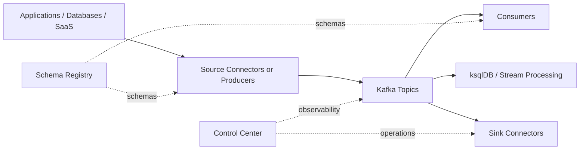

# Confluent Kafka Architecture

## Core Idea

Confluent Kafka is an event streaming platform built around Kafka brokers and extended with operational, governance, and integration services. At a high level, producers write events to topics, brokers persist and replicate them, and consumers or stream processors read them asynchronously.

## Main Components

### Kafka Brokers

- store topic partitions
- replicate data for durability
- serve producers and consumers
- handle partition leadership and fetch requests

### KRaft Controller

- manages cluster metadata in modern Kafka deployments
- replaces ZooKeeper in current Kafka architecture
- coordinates broker membership and metadata changes

### Schema Registry

- stores Avro, Protobuf, and JSON Schema definitions
- enforces schema compatibility policies
- helps prevent producer and consumer contract drift

### Kafka Connect

- runs source connectors that pull data into Kafka
- runs sink connectors that push data out of Kafka
- provides scalable, fault-tolerant integration without writing custom ingestion code for every system

### ksqlDB

- enables SQL-style stream processing on Kafka topics
- supports joins, aggregations, windowing, filtering, and derived streams/tables

### Control Center

- gives UI visibility into brokers, topics, consumers, connectors, and lag
- useful in local labs and self-managed environments

### Clients

- producers publish records
- consumers subscribe to topics and process records
- Streams apps and Flink-based pipelines can build stateful event processing on top of Kafka topics

## Logical Data Flow

## Deployment Models

### Confluent Cloud

- fully managed Kafka, connectors, governance, and related services
- best when teams want fast adoption and minimal infrastructure ownership
- common for product teams and mid-sized data platforms

### Confluent Platform Self-Managed

- install brokers and platform components on VMs, Kubernetes, or on-prem infrastructure
- best when strict network, compliance, latency, or data residency constraints apply
- requires strong platform engineering ownership

### Local Development Stack

- Docker Compose or local containers
- best for learning, demos, and CI smoke tests

## Topic Design Basics

- use stable topic names aligned to domain boundaries
- choose partition count based on throughput and consumer parallelism expectations
- set retention based on replay and compliance needs
- define key selection intentionally because it controls partitioning and ordering

Typical naming examples:

- `orders.created`
- `payments.authorized`
- `inventory.reserved`

## Partitioning and Ordering

- ordering is guaranteed only within a partition
- records with the same key go to the same partition when using the same partitioner
- higher partition counts improve parallelism but add operational overhead

## Consumer Groups

- all consumers in the same group share work across partitions
- different groups can read the same topic independently
- lag is the gap between produced offsets and committed consumer offsets

## Reliability Considerations

- use replication factor 3 in production where possible
- use `acks=all` for stronger producer durability guarantees
- configure idempotent producers for safer retries
- understand at-most-once, at-least-once, and exactly-once tradeoffs before choosing defaults

## Security Layers

- TLS for encryption in transit
- SASL for authentication
- ACLs or RBAC for authorization
- Schema Registry auth and connector secret handling as separate concerns

## Operating Principles

- Kafka is not a queue replacement in every case; it is an event log with replay semantics
- connectors reduce custom plumbing but still require data contract and error handling design
- schema governance becomes more important as the number of producing teams grows