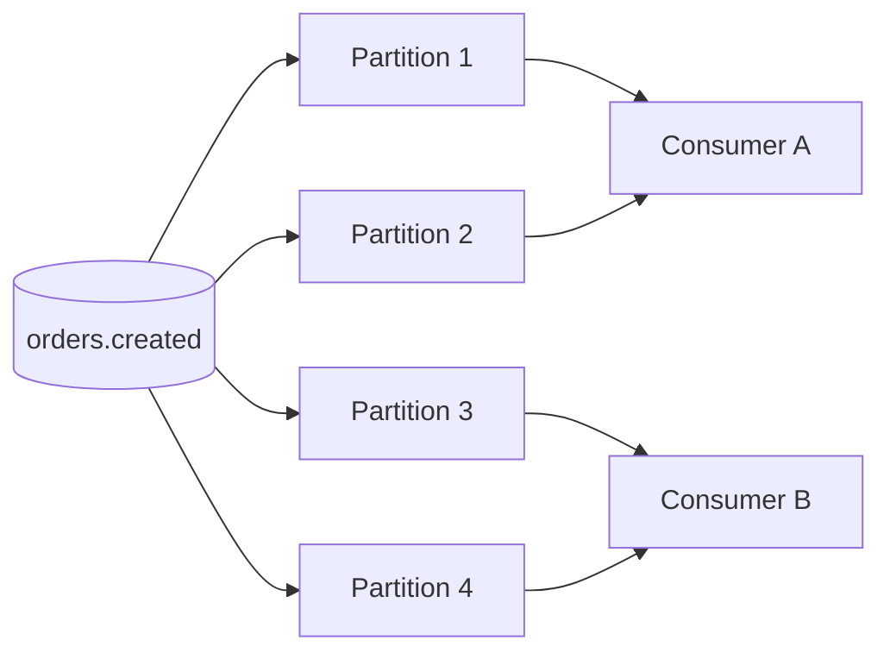

# Tutorial: Consumer Groups and Lag Monitoring

## Goal

Understand how consumer groups share work, how rebalancing behaves, what lag means, and how to monitor and respond to lag before it becomes an operational problem.

## Why This Matters

Most Kafka production incidents are not broker failures. They are consumer problems.

Typical issues:

- consumers fall behind
- rebalances interrupt processing
- teams overestimate parallelism
- lag is observed but not understood

If you understand consumer groups and lag, you can reason about throughput, stability, and recovery much more clearly.

## Consumer Group Basics

A consumer group is a set of consumers cooperating to read a topic.

Key rule:

- within a single group, one partition is assigned to only one active consumer at a time

This means:

- multiple consumers in the same group share work
- multiple different groups can read the same topic independently

## Example

If a topic has 4 partitions and your consumer group has 2 consumers:

- each consumer may handle 2 partitions

If the group has 6 consumers:

- only 4 consumers can receive partitions
- 2 consumers stay idle

This is why partition count sets the upper bound on consumer parallelism for a group.

## Visual Model



Another group can read the same topic separately without affecting this group.

## What Lag Means

Lag is the difference between:

- the latest offset written to a partition
- the last offset committed by a consumer group

Simple interpretation:

- higher lag means the consumer group is behind current production

Lag is not automatically bad. It depends on the workload and SLA.

## When Lag Is Normal

Lag may be normal when:

- consumers are catching up after restart
- batch-style consumers intentionally trail producers
- temporary traffic spikes exceed normal steady-state throughput

## When Lag Is A Problem

Lag becomes a problem when:

- it grows continuously instead of stabilizing
- real-time SLAs are missed
- downstream decisions are based on stale data
- consumers cannot catch up before retention expires

## Common Causes of Lag

- consumers process records too slowly
- too few partitions for required concurrency
- downstream databases or APIs are slow
- large message sizes increase processing time
- rebalances interrupt steady consumption
- consumer instances are unhealthy or under-provisioned

## Rebalancing

A rebalance happens when partition assignments change.

Common triggers:

- a consumer joins the group
- a consumer leaves or crashes
- subscription patterns change
- topic partition counts change

Rebalancing is normal, but frequent rebalances often indicate instability.

## Why Rebalancing Matters

During rebalances:

- assignments move between consumers
- processing can pause briefly
- poorly designed consumers may duplicate work or recover slowly

Stable groups usually perform better than constantly changing ones.

## Local Commands

Describe a consumer group:

```bash
kafka-consumer-groups --bootstrap-server localhost:9092 --describe --group orders-created-demo
```

List consumer groups:

```bash
kafka-consumer-groups --bootstrap-server localhost:9092 --list
```

These commands help show:

- current partition assignments
- committed offsets
- lag per partition

## Practical Interpretation

When reviewing lag, ask:

1. Is lag growing, stable, or shrinking?
2. Is the lag concentrated on one partition or spread across all partitions?
3. Is the bottleneck in Kafka consumption or downstream processing?
4. Can the group catch up before retention expires?

## Operational Responses

### Add Consumers

This helps only if:

- there are enough partitions available

If partitions are already fully assigned, extra consumers will sit idle.

### Increase Partitions

This may improve future parallelism, but it can also change partition placement and should not be done casually.

### Optimize Processing

Often the best fix is:

- faster downstream writes
- batched operations
- less expensive per-message logic
- better consumer resource sizing

### Separate Slow Work

If one consumer path is much slower:

- split heavy workloads from latency-sensitive workloads
- use separate consumer groups where appropriate

## Monitoring Signals

Useful signals include:

- lag by partition
- lag over time
- rebalance frequency
- consumer restart count
- processing latency per record or batch
- downstream dependency latency

Control Center is useful for visual lag inspection in local and self-managed Confluent environments.

## Common Mistakes

- assuming more consumers always means more throughput
- ignoring skew where one partition carries most of the traffic
- focusing only on Kafka and not on downstream bottlenecks
- treating all lag as equally severe
- allowing retention to be shorter than worst-case recovery time

## Practical Guidance

- monitor lag trends, not just single snapshots
- size partition count to realistic consumer concurrency needs
- keep consumer groups stable where possible
- design downstream systems so consumers can recover and catch up
- define acceptable lag based on business SLA, not abstract perfection

## Next Step

Proceed to `schema-registry.md` when you want to add governed schemas on top of well-designed consumer flows and topic patterns.