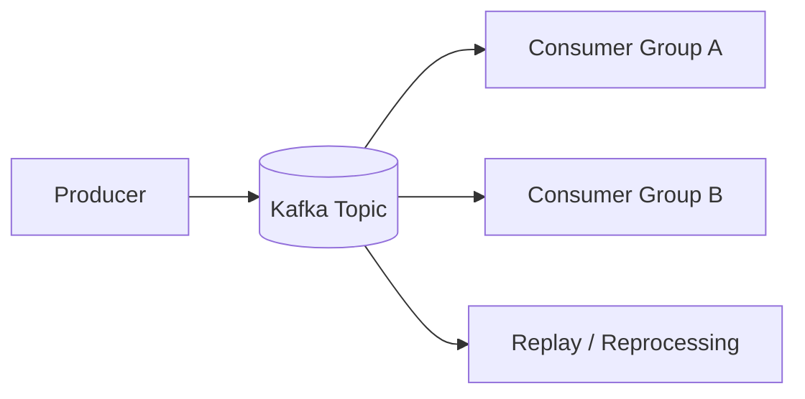

# Tutorial: Core Streaming

## Goal

Understand the core streaming model in Confluent Kafka: brokers, topics, partitions, producers, consumers, replication, retention, and replay.

## Why This Matters

Everything else in Confluent builds on top of the core streaming layer.

- Schema Registry depends on event streams
- Connect moves data in and out of Kafka topics
- ksqlDB and stream processors read and write Kafka topics
- governance and monitoring only make sense if the streaming layer is designed well

If the core model is unclear, the rest of the platform feels more complicated than it actually is.

## Core Concepts

### Brokers

Brokers are the servers that store topic partitions and serve read and write traffic.

They are responsible for:

- receiving producer writes
- serving consumer reads
- replicating data between brokers
- managing partition leadership

### Topics

Topics are named event streams.

Examples:

- `orders.created`
- `payments.authorized`
- `inventory.reserved`

A topic is not a single file or queue. It is a logical stream divided into partitions.

### Partitions

Partitions are the unit of:

- storage
- parallelism
- ordering

Important rule:

- ordering is guaranteed only within a single partition

If two events must remain strictly ordered, they should usually share a key that lands them in the same partition.

### Producers

Producers publish records to topics.

A producer decides:

- which topic to write to
- whether a key is present
- whether delivery should favor throughput or stronger durability

### Consumers

Consumers read records from topics.

Consumer groups allow multiple consumers to share work across partitions.

Important rule:

- within one consumer group, a partition is consumed by only one active group member at a time

### Retention and Replay

Kafka stores data for a retention period rather than deleting it immediately after consumption.

This means consumers can:

- re-read old events
- recover state after failures
- rebuild downstream systems

This replay model is one of Kafka's most important strengths.

### Replication

Kafka replicates partitions across brokers for durability.

Common production guidance:

- replication factor 3 where possible
- stronger producer acknowledgments such as `acks=all`

## Basic Flow



This is the core idea:

- producers write once
- many downstream consumers can read independently
- old data can be replayed when needed

## Partitioning Example

Assume a topic named `orders.created` with 3 partitions.

If records are keyed by `order_id`:

- all events for order `1001` go to the same partition
- all events for order `1002` go to the same partition
- ordering is preserved for each individual order key

This is why key design matters.

## Consumer Group Example

If a topic has 3 partitions and a consumer group has 2 consumers:

- one consumer may get 2 partitions
- one consumer may get 1 partition

If the group has 5 consumers:

- only 3 consumers can be active on assignments
- 2 consumers will sit idle because there are not enough partitions

This is why partition count shapes maximum parallelism.

## Local Hands-On Flow

### Step 1: Start a Local Environment

Use the install assets in `scripts/install/docker/` or `scripts/install/podman/`.

### Step 2: Create or Inspect Topics

```bash
kafka-topics --bootstrap-server localhost:9092 --list
```

Create a topic if needed:

```bash
kafka-topics --bootstrap-server localhost:9092 --create --topic orders.created --partitions 3 --replication-factor 1
```

### Step 3: Produce Events

```bash
kafka-console-producer --bootstrap-server localhost:9092 --topic orders.created --property parse.key=true --property key.separator=:
```

Send keyed records:

```text
1001:{"order_id":"1001","status":"CREATED"}
1001:{"order_id":"1001","status":"PAID"}
1002:{"order_id":"1002","status":"CREATED"}
```

### Step 4: Consume Events

```bash
kafka-console-consumer --bootstrap-server localhost:9092 --topic orders.created --from-beginning
```

Observe that the records are replayed from the beginning because of `--from-beginning`.

## What To Notice

- records are appended to a durable log
- consumers do not delete records when they read them
- replay is possible as long as retention has not expired
- key choice affects partition placement and ordering behavior

## Common Design Mistakes

- treating Kafka exactly like a traditional queue
- choosing random keys when ordering matters
- creating too few partitions for expected scale
- creating too many partitions without a throughput reason
- using unstable topic names tied to transient implementation details

## Practical Guidance

- use domain-based topic names
- pick keys intentionally
- design for replay from the beginning
- monitor lag and partition balance
- understand that throughput, ordering, and durability are connected tradeoffs

## Next Step

Proceed to `delivery-semantics.md` when you want to understand producer durability, retries, offset commits, duplicates, and exactly-once tradeoffs.