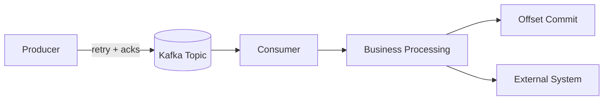

# Tutorial: Producer and Consumer Delivery Semantics

## Goal

Understand the main delivery guarantees in Kafka and how producer and consumer settings affect durability, duplicates, loss, retries, and replay behavior.

## Why This Matters

Many Kafka design problems are not really Kafka problems. They are delivery semantics problems.

If a team does not decide what guarantees it needs, it usually ends up with one of these failures:

- duplicate processing handled badly
- data loss discovered too late
- unnecessary latency from overly strict settings
- false assumptions about exactly-once behavior

## The Three Common Semantics

### At-Most-Once

The system favors avoiding duplicates, even if some messages may be lost.

This can happen when:

- offsets are committed before processing succeeds
- producer retries are limited or disabled in fragile flows

Use this only when occasional loss is acceptable.

### At-Least-Once

Messages are not intentionally lost, but duplicates may occur.

This is the most common practical model.

It usually means:

- producers retry on failure
- consumers commit offsets after successful processing
- downstream systems are designed to be idempotent

### Exactly-Once

Exactly-once is possible in defined Kafka workflows, but it is narrower than many teams assume.

It depends on:

- idempotent producers
- transactions where appropriate
- careful read-process-write patterns
- compatible downstream systems

Exactly-once is not a magic global property for every external side effect.

## Producer Settings That Matter

### `acks`

This controls how many broker acknowledgments are required before a write is considered successful.

- `acks=0`: fastest, weakest durability
- `acks=1`: leader acknowledges
- `acks=all`: strongest durability expectation in normal production designs

### Retries

Retries help avoid transient failures causing data loss.

But retries can introduce duplicates unless producer idempotence is enabled.

### Idempotence

`enable.idempotence=true` helps prevent duplicate writes caused by producer retries.

This should usually be enabled in production producer flows unless there is a specific reason not to.

### Batching and Compression

These affect throughput and latency, not just performance tuning.

- larger batching improves throughput
- higher batching can increase latency slightly
- compression reduces network and storage usage

## Consumer Behavior That Matters

### Offset Commits

Offsets determine where the consumer resumes.

Important rule:

- if you commit too early, you can lose messages
- if you commit late, you may reprocess messages after failure

### Auto Commit vs Manual Commit

Auto commit is easier, but less precise.

Manual commit gives tighter control over when processing is considered complete.

### Idempotent Consumers

Even with strong Kafka settings, many consumers should still be idempotent.

Typical strategies:

- deduplicate by business key
- use upsert semantics downstream
- track processed event identifiers when necessary

## Visual Model

The two critical questions are:

- when is a record considered successfully written?
- when is a record considered successfully processed?

## Practical Patterns

### Pattern 1: At-Least-Once Event Processing

Recommended when:

- business events must not be silently lost
- duplicates can be tolerated or handled

Typical shape:

- producer uses retries and idempotence
- producer uses `acks=all`
- consumer processes record
- consumer commits offset only after success

### Pattern 2: Idempotent Sink Writes

Recommended when:

- consumers update databases, search indexes, or materialized views

Typical shape:

- use stable business keys
- use upsert semantics downstream
- assume retries and reprocessing will happen

### Pattern 3: Read-Process-Write Pipelines

Recommended when:

- a service consumes one topic and produces another

Typical shape:

- use idempotent producers
- consider transactions if the architecture justifies the complexity
- avoid claiming exactly-once unless the whole path is designed for it

## Local Thinking Exercise

Imagine a consumer that reads `orders.created` and writes to a billing database.

If it commits offsets before the database write finishes:

- a crash may lose the event from the billing workflow

If it commits offsets after the database write finishes:

- a crash may replay the event and write it again

This is why idempotent downstream design matters.

## Common Mistakes

- assuming Kafka alone guarantees exactly-once everywhere
- ignoring duplicate handling in downstream systems
- using weak producer durability in critical workflows
- committing offsets before business work succeeds
- mixing low-latency goals with high-durability expectations without acknowledging tradeoffs

## Practical Guidance

- default to at-least-once unless you have a strong reason otherwise
- enable idempotent producers in production-oriented flows
- commit offsets after successful processing
- make downstream writes idempotent where possible
- reserve exactly-once claims for carefully designed end-to-end paths

## Next Step

Proceed to `topic-design-and-partitions.md` when you want to design topic names, keys, partitions, and retention settings more intentionally.