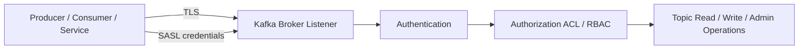

# Tutorial: Kafka Security, TLS, SSL, and SASL

## Goal

Understand the main Kafka security layers, what TLS and SASL actually do, how authorization fits in, and how to approach a practical secure setup in Confluent environments.

## Why This Matters

Kafka security has multiple layers, and teams often mix them up.

Common confusion points:

- using TLS and assuming authentication is solved
- using SASL and assuming traffic is encrypted
- enabling authentication but forgetting authorization
- securing brokers but forgetting Schema Registry, Connect, or ksqlDB

The right mental model is:

1. encrypt traffic
2. authenticate clients and services
3. authorize access to topics and operations
4. secure the surrounding platform components too

## The Three Main Security Layers

### TLS / SSL

TLS secures traffic in transit.

It provides:

- encryption
- certificate-based identity validation
- protection against traffic interception between clients and brokers

TLS does not automatically decide who is allowed to read or write specific topics.

### SASL

SASL is the authentication framework Kafka uses for client identity in many deployments.

Common mechanisms:

- `PLAIN`
- `SCRAM-SHA-256`
- `SCRAM-SHA-512`
- `OAUTHBEARER`
- `GSSAPI` for Kerberos-based environments

SASL answers the question:

- who is this client?

### Authorization

After a client is authenticated, Kafka still needs to decide what it may do.

Common authorization models:

- ACLs
- RBAC in supported Confluent environments

Authorization answers the question:

- what is this client allowed to do?

## Visual Model



## TLS vs SASL

These are not mutually exclusive.

Typical combinations:

- `PLAINTEXT`: no encryption, no auth
- `SSL`: encryption with certificate-based security
- `SASL_PLAINTEXT`: authentication without transport encryption
- `SASL_SSL`: authentication plus transport encryption

For most production systems, `SASL_SSL` is the safest default direction.

## Common Deployment Patterns

### Pattern 1: TLS Only

Use when:

- certificate-based trust is enough
- a tightly controlled environment handles identity through certificates

Tradeoff:

- simpler in some infrastructures
- less flexible than SASL-based user management for many teams

### Pattern 2: SASL_SSL with SCRAM

Use when:

- you want username and password style authentication
- you want encrypted transport
- you need a practical production baseline

This is common in self-managed secure deployments.

### Pattern 3: Managed Cloud Security

In Confluent Cloud, much of the security surface is handled through managed networking, API keys, RBAC, and managed certificates rather than hand-managed broker config.

## Broker Listener Concepts

Kafka security is usually configured per listener.

A deployment may have:

- an internal broker listener
- a client listener
- a controller listener

Security can differ by listener, but that flexibility can also create confusion if naming is inconsistent.

## Example Listener Configuration Shape

This is an illustrative pattern, not a full production config:

```properties
listeners=INTERNAL://0.0.0.0:9092,EXTERNAL://0.0.0.0:9093,CONTROLLER://0.0.0.0:9094
advertised.listeners=INTERNAL://broker:9092,EXTERNAL://kafka.example.com:9093
listener.security.protocol.map=INTERNAL:SASL_SSL,EXTERNAL:SASL_SSL,CONTROLLER:PLAINTEXT
inter.broker.listener.name=INTERNAL
sasl.enabled.mechanisms=SCRAM-SHA-512
sasl.mechanism.inter.broker.protocol=SCRAM-SHA-512
ssl.keystore.location=/etc/kafka/secrets/broker.keystore.jks
ssl.keystore.password=changeit
ssl.key.password=changeit
ssl.truststore.location=/etc/kafka/secrets/broker.truststore.jks
ssl.truststore.password=changeit
authorizer.class.name=org.apache.kafka.metadata.authorizer.StandardAuthorizer
allow.everyone.if.no.acl.found=false
```

Important point:

- controller listener security may differ in KRaft deployments
- broker-to-broker traffic and client traffic should both be designed intentionally

## Example Client Configuration Shape

Example Java-style client properties for `SASL_SSL` with SCRAM:

```properties
bootstrap.servers=kafka.example.com:9093
security.protocol=SASL_SSL
sasl.mechanism=SCRAM-SHA-512
sasl.jaas.config=org.apache.kafka.common.security.scram.ScramLoginModule required username="app-user" password="change-me";
ssl.truststore.location=/etc/app/client.truststore.jks
ssl.truststore.password=changeit
```

Important point:

- brokers need server-side security config
- clients need matching protocol, mechanism, and trust configuration

## mTLS

Mutual TLS means both client and broker present certificates.

Use this when:

- certificate-based client identity is required
- security policy strongly prefers PKI-based trust

This is stronger operationally, but certificate lifecycle management becomes more important.

## ACL Basics

ACLs are used to restrict who can:

- read a topic
- write a topic
- create topics
- alter configs
- join consumer groups

Typical principle:

- grant only the minimum required permissions

Examples of entities that often need explicit authorization:

- producer principals
- consumer principals
- connector service accounts
- admin users

## Example ACL Thinking

A producer application that only writes `orders.created` should not also have broad admin access.

A consumer group that reads payment topics should not automatically read customer or security topics.

Security becomes easier when principals map clearly to applications or teams.

## Practical Setup Sequence

### Step 1: Decide the Security Model

Choose:

- TLS only
- SASL_SSL with SCRAM
- mTLS
- managed Confluent Cloud auth model

Do not start by copying random broker configs.

### Step 2: Secure Broker Listeners

Define:

- listener names
- security protocols per listener
- certificates and truststores
- SASL mechanisms if used

### Step 3: Create Principals or Credentials

Depending on the model, provision:

- SCRAM users
- API keys
- service accounts
- certificates

### Step 4: Apply Authorization

Grant least-privilege access with:

- ACLs
- RBAC where supported and appropriate

### Step 5: Secure Platform Components

Do not stop at brokers.

Also secure:

- Schema Registry
- Kafka Connect
- ksqlDB
- Control Center

### Step 6: Validate With Real Clients

Test:

- producer connectivity
- consumer connectivity
- expected denial for unauthorized actions
- certificate expiration or trust failures

## Common Mistakes

- using `SASL_PLAINTEXT` in production without understanding the risk
- allowing broad wildcard ACLs to avoid short-term setup work
- forgetting consumer-group permissions when consumers fail unexpectedly
- securing external traffic but not internal broker traffic
- failing to rotate credentials and certificates
- documenting the protocol incompletely so clients cannot connect reliably

## Confluent Cloud vs Self-Managed

### Confluent Cloud

- managed Kafka security posture
- API keys and managed auth models
- networking options such as private access depending on provider and tier
- much less broker-level certificate handling by the user

### Self-Managed Confluent Platform

- full control over listeners, certificates, SASL mechanisms, and ACLs
- more operational burden
- more opportunity for configuration mistakes if the security model is not documented clearly

## Practical Guidance

- prefer encrypted transport by default
- prefer explicit per-application principals
- document listener names and protocols clearly
- treat Connect, Schema Registry, and ksqlDB as first-class security surfaces
- test both allowed and denied actions before calling the setup complete

## Hands-On Example

This repository includes a local hands-on example in:

- `examples/security/local-sasl-ssl/`

Use `kafka-security-local-setup.md` if you want to walk through sample broker properties, client properties, and ACL examples.

That local example also includes:

- a certificate generation helper
- secured Schema Registry Kafka client properties
- secured Kafka Connect worker properties
- secured ksqlDB server properties
- a Docker secure-local profile that mounts certs and security config automatically

## Next Step

Proceed to `schema-registry.md` when you want to extend these security patterns to governed schemas and adjacent platform components.