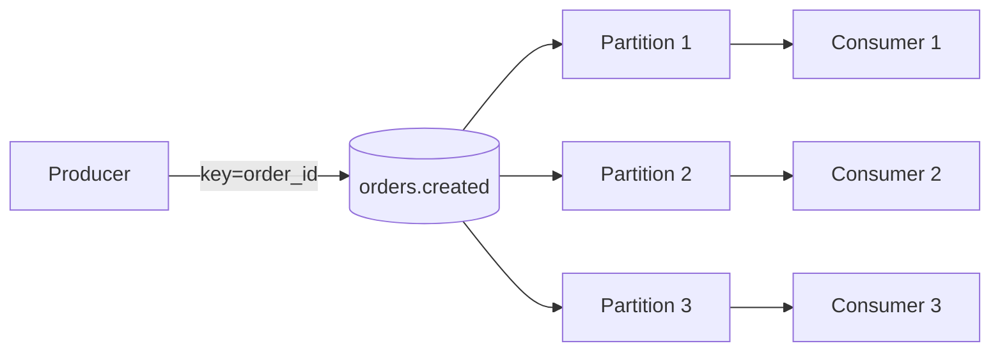

# Tutorial: Topic Design and Partition Strategy

## Goal

Learn how to choose topic names, keys, partition counts, and retention settings so Kafka topics remain understandable, scalable, and operationally stable.

## Why This Matters

Topic design is one of the highest-leverage decisions in Kafka.

Poor topic design usually causes:

- unclear ownership
- broken ordering assumptions
- low consumer parallelism
- unnecessary operational overhead
- painful migrations later

Good topic design reduces coupling and gives teams a cleaner event model.

## Start With the Domain

A Kafka topic should usually represent a stable business stream, not a temporary implementation detail.

Good examples:

- `orders.created`
- `payments.authorized`
- `inventory.reserved`

Weaker examples:

- `service1-output`
- `temp-sync-topic`
- `queue-abc`

Prefer names that reflect domain meaning and survive service refactors.

## Topic Naming Principles

Use topic names that are:

- domain-oriented
- stable over time
- readable by humans
- consistent across teams

Common patterns:

- `domain.event`
- `domain.entity.action`
- `boundedcontext.entity.events`

Examples:

- `customer.profile-updated`
- `shipment.status-changed`
- `billing.invoice-issued`

## Key Design

The record key is one of the most important design choices because it affects partition placement and ordering.

Use a key when:

- events for the same entity must stay ordered
- downstream consumers need deterministic grouping
- the topic may later be compacted by key

Examples of useful keys:

- `order_id`
- `customer_id`
- `shipment_id`

Do not pick a random key if the business entity has a stable identity.

## Partition Strategy

Partitions control:

- parallelism
- throughput
- per-key ordering

General rule:

- more partitions increase scaling capacity
- more partitions also increase operational complexity

### Too Few Partitions

Problems:

- limited consumer parallelism
- hot partitions under higher load
- harder scaling later

### Too Many Partitions

Problems:

- more metadata overhead
- more rebalancing cost
- more operational noise
- harder-to-justify complexity in small systems

## Ordering Tradeoff

Ordering is guaranteed only within a partition.

If all events for one `order_id` must stay ordered:

- use `order_id` as the key
- accept that ordering is per key, not across the whole topic

You cannot usually maximize global ordering and maximum parallelism at the same time.

## Visual Model

The key decides where records land, and partitions decide the maximum parallelism available to consumers.

## Retention Strategy

Retention should reflect business and operational needs.

Ask:

- how far back might consumers need to replay?
- is the topic operational, analytical, or regulatory in nature?
- do downstream teams depend on late recovery?

Examples:

- short retention for noisy transient streams
- longer retention for core business event streams
- compaction for latest-state topics keyed by entity ID

## Compaction vs Delete Retention

### Delete-Based Retention

Records expire after a configured retention window.

Good for:

- event history
- append-only streams
- time-based replay needs

### Log Compaction

Kafka retains the latest value per key.

Good for:

- current-state topics
- profile views
- materialized entity snapshots

Compaction does not mean immediate cleanup. It is still an asynchronous storage behavior.

## Example Decisions

### Order Lifecycle Topic

- topic: `orders.events`
- key: `order_id`
- partitions: sized for expected order throughput and consumer concurrency
- retention: long enough for audit, replay, and support use cases

### Customer Profile Topic

- topic: `customer.profile-updates`
- key: `customer_id`
- partitions: sized for customer update volume
- cleanup: compaction may make sense for current-state rebuilds

### Telemetry Topic

- topic: `telemetry.raw`
- key: `device_id`
- partitions: typically higher because throughput is high
- retention: shorter on raw topics if normalized topics or lake storage exist downstream

## Common Mistakes

- naming topics after internal services instead of domains
- using no key when entity ordering matters
- picking partition counts without throughput or concurrency reasoning
- creating one huge shared topic for unrelated event types
- putting unrelated retention needs into one topic

## Practical Guidance

- prefer stable domain names
- choose keys based on business identity
- size partitions for expected concurrency, not guesswork alone
- separate raw, curated, and latest-state topics when their needs differ
- treat retention as part of product design, not just broker configuration

## Next Step

Proceed to `consumer-groups-and-lag.md` when you want to understand how those partitions affect parallelism, lag, and operational stability.