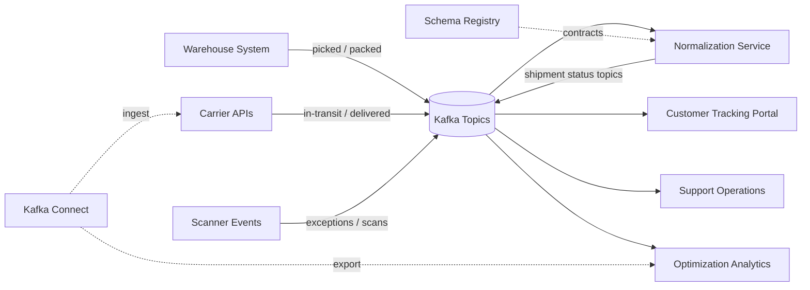

# Logistics and Shipment Tracking

## Business Problem

A logistics company needs a unified view of shipment movement across warehouse systems, carrier APIs, handheld scanners, and customer tracking portals.

## Event-Driven Approach

Shipment milestones are published as events so internal systems and customers see the same progression with minimal delay.

Core topics:

- `shipments.created`
- `warehouse.picked`
- `warehouse.packed`
- `carrier.in-transit`
- `carrier.delivered`
- `shipment.exceptions`

## Confluent Components

- Kafka brokers persist shipment milestones as an immutable timeline
- Schema Registry governs shipment and carrier event contracts
- Connect ingests carrier updates and exports events to support or analytics systems
- ksqlDB detects delayed shipments, exception patterns, and regional bottlenecks

## Example Architecture

1. Warehouse management system publishes pick and pack events.
2. Carrier integrations publish in-transit milestones.
3. Exception events are produced for missed scans, delays, or damaged packages.
4. Customer-facing applications consume curated shipment status topics.
5. Data lake sinks capture historical movement for optimization analysis.

## Topic Design

- key by `shipment_id`
- keep carrier raw topics separate from normalized shipment milestone topics
- compact latest-state topics if teams need fast point-in-time tracking views

## Connector Choices

Source:

- JDBC CDC from warehouse systems
- HTTP or SaaS connector patterns for carrier APIs
- file or object storage imports for batch carrier manifests

Destinations:

- warehouse sinks for network optimization analytics
- search sinks for support agent shipment lookup
- downstream notification systems via connector or application consumers

## Schema Guidance

- normalize milestone names across carriers
- preserve original carrier codes as reference fields
- make location fields and timezone handling explicit

## ksqlDB Opportunities

- detect shipments that have not advanced within expected windows
- aggregate delays by carrier, region, or warehouse
- create live tables of open shipment exceptions

## Operational Concerns

- late and out-of-order events are common in logistics
- regional traffic bursts may require partition tuning around shipment volume peaks
- customer-facing tracking depends on low-latency downstream propagation

## Why Kafka Fits

Shipment tracking is inherently event-driven, cross-system, and audit-heavy. Kafka provides a durable timeline that multiple internal and external consumers can use independently.