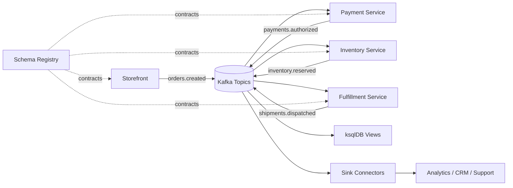

# Retail Order Lifecycle

## Business Problem

An e-commerce platform needs consistent order state across storefront, payment, warehouse, shipping, and customer notification systems. Point-to-point integrations are creating delays and inconsistent order status.

## Event-Driven Approach

The order journey is modeled as a stream of domain events:

- `orders.created`
- `payments.authorized`
- `inventory.reserved`
- `orders.fulfillment.started`
- `shipments.dispatched`
- `orders.completed`

Each service publishes facts about state changes instead of directly coordinating every downstream action.

## Confluent Components

- Kafka brokers hold the event log for the order lifecycle
- Schema Registry governs the contract for order and payment events
- Kafka Connect moves data to warehouses, search systems, and notification platforms
- ksqlDB creates operational views such as delayed orders or failed payment rollups

## Example Architecture

1. Storefront publishes `orders.created`.
2. Payment service consumes order events and publishes `payments.authorized` or `payments.failed`.
3. Inventory service reserves stock and emits `inventory.reserved`.
4. Fulfillment system consumes enriched order state and starts picking and packing.
5. Sink connectors push final order events to analytics, CRM, or support systems.

## Topic Design

- key by `order_id`
- use one event type per topic if teams want strong ownership boundaries
- retain raw lifecycle events long enough for replay and support investigations

Example topics:

- `orders.created`
- `orders.status-changed`
- `payments.events`
- `inventory.events`
- `shipments.events`

## Connector Choices

Source:

- JDBC source or Debezium for order database CDC
- SaaS connectors for CRM or commerce platforms

Destinations:

- S3 sink for analytics lake storage
- Elasticsearch sink for customer support order lookup
- JDBC sink for operational read models if required

## Schema Guidance

- put `order_id`, `customer_id`, `event_time`, and `event_version` in every order-domain event
- keep event names domain-based, not service-based
- use backward-compatible schema evolution for new optional fields

## ksqlDB Opportunities

- derive a table of current order status
- detect orders stuck in a specific state beyond SLA
- aggregate daily order volume by region or payment type

## Operational Concerns

- ensure idempotent event handling for retries
- separate command workflows from domain event topics
- define dead-letter handling for malformed upstream events

## Why Kafka Fits

Kafka provides replayability, clear decoupling between services, and a durable event history for operational recovery and analytics.