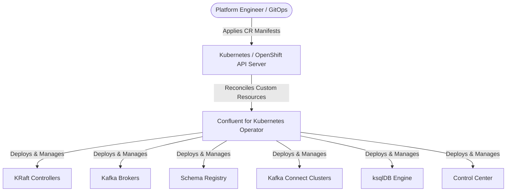
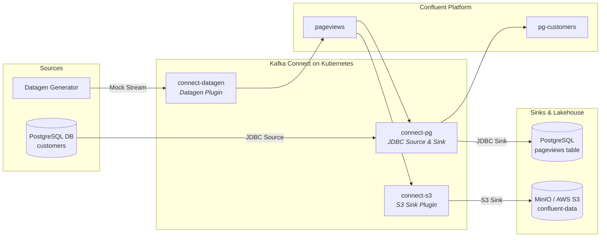

# Tutorial 04: Deploying and Operating Confluent on Kubernetes with CFK

## Prerequisites

- Familiarity with basic Kubernetes or OpenShift concepts (Pods, Services, StatefulSets, Custom Resources).
- A running Kubernetes (v1.26+) or Red Hat OpenShift (v4.14+) cluster.
- CLI access with `kubectl` / `oc` and `helm` (v3+).
- Minimum cluster capacity: 6 vCPUs and 16 GB free RAM across worker/schedulable nodes.

---

## 1. Introduction: What is Confluent for Kubernetes (CFK)?

**Confluent for Kubernetes (CFK)** is an enterprise-grade Kubernetes Operator that automates the deployment, provisioning, scaling, configuration, and day-2 management of Confluent Platform.

Instead of managing individual Kafka configuration files (`server.properties`), Zookeeper quorums, or manual rolling restarts, CFK introduces **Custom Resource Definitions (CRDs)**. You describe your desired streaming platform in standard declarative YAML manifests, and the operator reconciles the live Kubernetes resources continuously.



---

## 2. CFK Custom Resources Glossary

| Custom Resource (CRD) | Kind | Role in Confluent Platform |
| :--- | :--- | :--- |
| `kraftcontrollers.platform.confluent.io` | `KRaftController` | Quorum-based metadata and cluster consensus management (replaces Apache ZooKeeper). |
| `kafkas.platform.confluent.io` | `Kafka` | The core Kafka messaging brokers for topic storage, partitioning, and replication. |
| `schemaregistries.platform.confluent.io` | `SchemaRegistry` | Centralized RESTful governance for Avro, JSON, and Protobuf schema evolution. |
| `connects.platform.confluent.io` | `Connect` | Scalable distributed worker cluster for running source and sink integration connectors. |
| `connectors.platform.confluent.io` | `Connector` | Declarative configuration instance of a specific source or sink connector task. |
| `ksqldbs.platform.confluent.io` | `KsqlDB` | Event streaming SQL engine for real-time stream processing. |
| `controlcenters.platform.confluent.io` | `ControlCenter` | Web console UI for cluster administration, topic inspection, and consumer lag monitoring. |
| `kafkarestproxies.platform.confluent.io` | `KafkaRestProxy` | HTTP REST interface to produce and consume messages from Kafka without native TCP protocol. |
| `kafkatopics.platform.confluent.io` | `KafkaTopic` | Declarative topic provisioning (partitions, replication factor, retention policies). |
| `schemas.platform.confluent.io` | `Schema` | Declarative schema registration tied to topics in Schema Registry. |

---

## 3. Step-by-Step Deployment Architecture

### Phase 1: Security & Cluster Preparation (OpenShift Specifics)
By default, OpenShift enforces the `restricted-v2` Security Context Constraint (SCC), which forces containers to run with arbitrary UIDs. Confluent Platform container images run as a deterministic fixed UID (`1001`).

To permit Confluent containers to execute:
```bash
# Create target namespace
oc new-project confluent

# Grant anyuid SCC to the project service accounts
oc adm policy add-scc-to-group anyuid system:serviceaccounts:confluent
```

*(On vanilla Kubernetes / EKS / GKE, this step is omitted as pods can run as UID 1001 by default).*

---

### Phase 2: Installing the CFK Operator via Helm

Install the operator chart from the official Confluent repository:

```bash
# 1. Add repository
helm repo add confluentinc https://packages.confluent.io/helm
helm repo update

# 2. Deploy operator
helm upgrade --install confluent-operator confluentinc/confluent-for-kubernetes \
  --namespace confluent
```

Verify the operator pod is running:
```bash
kubectl get pods -n confluent -l app.kubernetes.io/name=confluent-operator
```

---

### Phase 3: Declarative Component Deployment Sequence

Because later services depend on earlier services during startup, apply manifests in logical order:

```
KRaft Controller  -->  Kafka Brokers  -->  Schema Registry  -->  Connect & ksqlDB  -->  Control Center
```

#### 1. KRaft Metadata Quorum
Deploy a 3-node KRaft quorum:
```yaml
apiVersion: platform.confluent.io/v1beta1
kind: KRaftController
metadata:
  name: kraftcontroller
  namespace: confluent
spec:
  replicas: 3
  dataVolumeCapacity: 10Gi
  image:
    application: docker.io/confluentinc/cp-server:7.9.0
    init: confluentinc/confluent-init-container:2.11.0
  podTemplate:
    resources:
      requests: { cpu: 250m, memory: 1Gi }
      limits: { cpu: "1", memory: 2Gi }
```

#### 2. Kafka Broker Cluster
Deploy the 3-node Kafka broker cluster referencing the KRaft cluster:
```yaml
apiVersion: platform.confluent.io/v1beta1
kind: Kafka
metadata:
  name: kafka
  namespace: confluent
spec:
  replicas: 3
  dependencies:
    kRaftController:
      clusterRef:
        name: kraftcontroller
  dataVolumeCapacity: 10Gi
  image:
    application: docker.io/confluentinc/cp-server:7.9.0
    init: confluentinc/confluent-init-container:2.11.0
  podTemplate:
    resources:
      requests: { cpu: 500m, memory: 2Gi }
      limits: { cpu: "1500m", memory: 4Gi }
```

#### 3. Schema Registry
```yaml
apiVersion: platform.confluent.io/v1beta1
kind: SchemaRegistry
metadata:
  name: schemaregistry
  namespace: confluent
spec:
  replicas: 1
  image:
    application: confluentinc/cp-schema-registry:7.9.0
    init: confluentinc/confluent-init-container:2.11.0
  podTemplate:
    resources:
      requests: { cpu: 250m, memory: 1Gi }
      limits: { cpu: "1", memory: 2Gi }
```

---

## 4. Ingestion & Egress Pipelines: Connect, S3 & PostgreSQL

CFK supports **on-demand plugin builds** directly from Confluent Hub.



### Pattern: Domain-Tiered Connect Clusters
Rather than bundling dozens of JARs into a single monolithic worker, deploy **purpose-specific Connect clusters**:

1. **`connect-pg`**: Packaged with `confluentinc/kafka-connect-jdbc:10.7.6` for relational DB integration.
2. **`connect-s3`**: Packaged with `confluentinc/kafka-connect-s3:10.5.18` for object storage and lakehouse sinking.
3. **`connect-datagen`**: Packaged with `confluentinc/kafka-connect-datagen:0.6.6` for test streams.

---

## 5. Exposing Endpoints: Kubernetes Ingress vs OpenShift Routes

To access Control Center, Schema Registry, and Flink outside the Kubernetes cluster:

| Component | Port | OpenShift Route Command | Kubernetes Ingress Annotation |
| :--- | :--- | :--- | :--- |
| **Control Center** | `9021` | `oc create route edge controlcenter --service=controlcenter --port=9021 --insecure-policy=Redirect` | `ingress.class: nginx`, `ssl-redirect: "true"` |
| **Flink Web UI** | `8081` | `oc create route edge flink-web --service=flink-jobmanager --port=ui --insecure-policy=Redirect` | `ingress.class: nginx` |
| **MinIO Console** | `9001` | `oc create route edge minio-console --service=minio --port=console --insecure-policy=Redirect` | `ingress.class: nginx` |

---

## 6. Sizing, Resource Limits & Troubleshooting Guide

### Production Resource Sizing Matrix

| Component | Minimum Heap (`-Xms/-Xmx`) | K8s CPU Request / Limit | K8s Memory Request / Limit | Persistent Storage |
| :--- | :--- | :--- | :--- | :--- |
| **KRaft Controller** | 1 GB / 1 GB | `250m` / `1000m` | `1Gi` / `2Gi` | 10–50 GB SSD |
| **Kafka Broker** | 2 GB / 2 GB | `1000m` / `2000m` | `2Gi` / `4Gi` | 100 GB–2 TB NVMe/SSD |
| **Schema Registry** | 512 MB / 1 GB | `250m` / `1000m` | `1Gi` / `2Gi` | Stateless |
| **Connect Worker** | 1 GB / 2 GB | `500m` / `1500m` | `1Gi` / `2Gi` | Stateless |
| **Control Center** | 2 GB / 3 GB | `500m` / `1500m` | `2Gi` / `4Gi` | 10–50 GB SSD |

---

### Common Operational Issues & Remediation

#### 1. `CreateContainerConfigError` on Pod Startup
- **Root Cause**: The container is attempting to run as UID 1001, which violates the default OpenShift `restricted-v2` SCC.
- **Fix**:
  ```bash
  oc adm policy add-scc-to-group anyuid system:serviceaccounts:confluent
  ```

#### 2. Pods stuck in `Pending` with `FailedScheduling` (Insufficient CPU/Memory)
- **Root Cause**: Worker nodes are over-allocated by platform services (Ceph/ODF, Prometheus).
- **Fix**: Allow master/control-plane nodes to accept pods:
  ```bash
  oc patch schedulers.config.openshift.io cluster --type merge --patch '{"spec":{"mastersSchedulable":true}}'
  ```

#### 3. Control Center `504 Gateway Timeout` or OOM Crash
- **Root Cause**: Control Center manages internal Kafka Streams topologies for each connected cluster and connector. When tracking multiple Connect clusters, it requires at least 2 GB heap / 4 GB container limit.
- **Fix**: Update `ControlCenter` CR `podTemplate.resources.limits.memory: "4Gi"`.

#### 4. `UNKNOWN_TOPIC_OR_PARTITION` in Connect Sinks / Sources
- **Root Cause**: Kafka broker has `auto.create.topics.enable=false`.
- **Fix**: Pre-create target Kafka topics using `kafka-topics --create` or the `KafkaTopic` custom resource before initializing connectors.
