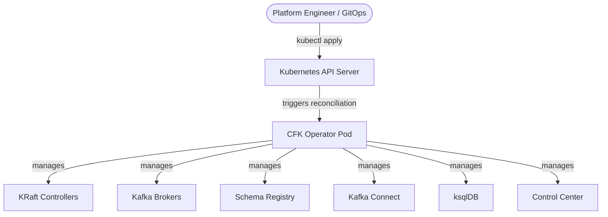
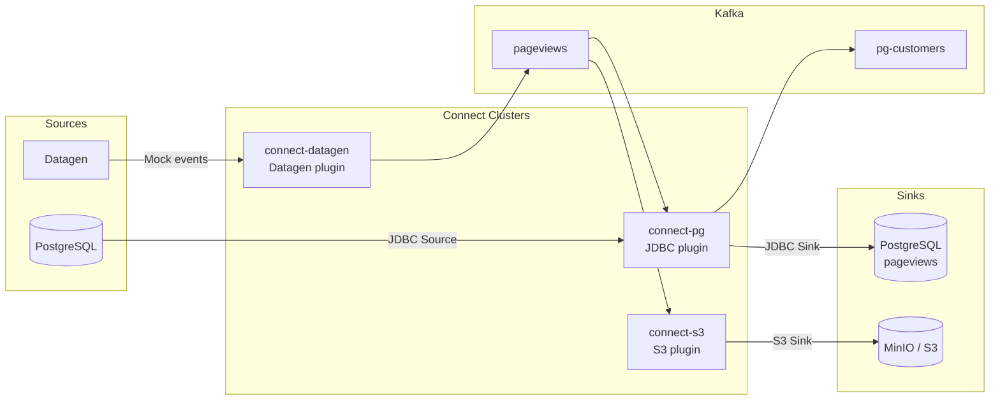

# Tutorial 04: Confluent for Kubernetes (CFK)

## Prerequisites

- Basic familiarity with Kubernetes concepts: Pods, Services, StatefulSets, Namespaces.
- A running Kubernetes (v1.26+) or Red Hat OpenShift (v4.14+) cluster.
- `kubectl` / `oc` and `helm` (v3+) configured against that cluster.
- Minimum schedulable capacity across worker nodes: **6 vCPUs** and **16 GB RAM**.

---

## 1. What is Confluent for Kubernetes?

**Confluent for Kubernetes (CFK)** is an enterprise Kubernetes Operator that manages the full lifecycle of Confluent Platform — deployment, configuration, scaling, rolling upgrades, and day-2 operations.

Instead of hand-crafting `server.properties` files, managing ZooKeeper quorums, or scripting rolling restarts, you write **declarative YAML manifests** using Kubernetes Custom Resources. The CFK operator watches those resources and continuously reconciles the live cluster state to match what you declared.



**Why this matters:**

| Without CFK | With CFK |
|---|---|
| Manually edit `server.properties` per broker | Declare broker config once in a `Kafka` CR |
| Script rolling restarts for config changes | Operator handles rolling updates automatically |
| ZooKeeper quorum management | KRaft controller quorum managed as a CR |
| Ad-hoc `kubectl` commands for scaling | Change `replicas:` in YAML — operator does the rest |
| No audit trail for config changes | Git-tracked YAML manifests = GitOps ready |

---

## 2. Custom Resource Definitions (CRDs)

CFK registers the following CRDs with Kubernetes. Each represents one logical component of Confluent Platform:

| Kind | API Group | Purpose |
|:---|:---|:---|
| `KRaftController` | `platform.confluent.io/v1beta1` | Metadata quorum (replaces ZooKeeper). Manages leader election and cluster consensus. |
| `Kafka` | `platform.confluent.io/v1beta1` | Kafka broker cluster. Handles topic storage, partitioning, and replication. |
| `SchemaRegistry` | `platform.confluent.io/v1beta1` | Centralized Avro / JSON / Protobuf schema governance and evolution. |
| `Connect` | `platform.confluent.io/v1beta1` | Distributed Kafka Connect worker cluster. Runs source and sink connectors. |
| `Connector` | `platform.confluent.io/v1beta1` | A single connector instance (e.g. one JDBC source task) running inside a Connect cluster. |
| `KsqlDB` | `platform.confluent.io/v1beta1` | SQL engine for real-time stream processing over Kafka topics. |
| `ControlCenter` | `platform.confluent.io/v1beta1` | Web console for cluster administration, topic browsing, and consumer lag monitoring. |
| `KafkaRestProxy` | `platform.confluent.io/v1beta1` | HTTP REST interface for producing and consuming messages without a native Kafka client. |
| `KafkaTopic` | `platform.confluent.io/v1beta1` | Declarative topic provisioning — partitions, replication factor, retention. |
| `Schema` | `platform.confluent.io/v1beta1` | Declarative schema registration linked to a topic in Schema Registry. |

---

## 3. Deployment Walkthrough

### Step 1 — Namespace & Security (OpenShift only)

OpenShift's default `restricted-v2` Security Context Constraint (SCC) forces containers to run as an arbitrary unpredictable UID. Confluent Platform images require UID `1001`. Grant the `anyuid` SCC to allow this:

```bash
# Create the target namespace
oc new-project confluent

# Allow Confluent containers to run as UID 1001
oc adm policy add-scc-to-group anyuid system:serviceaccounts:confluent
```

> On vanilla Kubernetes, EKS, or GKE this step is not needed — pods can run as UID 1001 by default.

---

### Step 2 — Install the CFK Operator

```bash
# Add the Confluent Helm repository
helm repo add confluentinc https://packages.confluent.io/helm
helm repo update

# Install the operator into the confluent namespace
helm upgrade --install confluent-operator confluentinc/confluent-for-kubernetes \
  --namespace confluent
```

Verify the operator is running before proceeding:

```bash
kubectl get pods -n confluent -l app.kubernetes.io/name=confluent-operator
```

Expected output:
```
NAME                                  READY   STATUS    RESTARTS   AGE
confluent-operator-7d6f9b8c4d-xkt2p   1/1     Running   0          45s
```

---

### Step 3 — Deploy Confluent Platform Components

Apply manifests in dependency order — each component depends on the ones before it being healthy:

```
KRaftController  →  Kafka  →  SchemaRegistry  →  Connect / KsqlDB  →  ControlCenter
```

#### KRaft Metadata Quorum

A 3-node KRaft quorum provides high-availability metadata management without ZooKeeper:

```yaml
# cfk-openshift/manifests/01-kraftcontroller.yaml
apiVersion: platform.confluent.io/v1beta1
kind: KRaftController
metadata:
  name: kraftcontroller
  namespace: confluent
spec:
  replicas: 3
  dataVolumeCapacity: 10Gi
  image:
    application: docker.io/confluentinc/cp-server:7.9.0
    init: confluentinc/confluent-init-container:2.11.0
  podTemplate:
    resources:
      requests:
        cpu: 250m
        memory: 1Gi
      limits:
        cpu: "1"
        memory: 2Gi
```

Wait for all three controller pods to be `Running` before continuing:

```bash
kubectl get kraftcontroller -n confluent
```

#### Kafka Broker Cluster

A 3-node broker cluster, referencing the KRaft quorum by name:

```yaml
# cfk-openshift/manifests/02-kafka.yaml
apiVersion: platform.confluent.io/v1beta1
kind: Kafka
metadata:
  name: kafka
  namespace: confluent
spec:
  replicas: 3
  dependencies:
    kRaftController:
      clusterRef:
        name: kraftcontroller
  dataVolumeCapacity: 10Gi
  image:
    application: docker.io/confluentinc/cp-server:7.9.0
    init: confluentinc/confluent-init-container:2.11.0
  podTemplate:
    resources:
      requests:
        cpu: 500m
        memory: 2Gi
      limits:
        cpu: "1500m"
        memory: 4Gi
```

#### Schema Registry

```yaml
# cfk-openshift/manifests/03-schemaregistry.yaml
apiVersion: platform.confluent.io/v1beta1
kind: SchemaRegistry
metadata:
  name: schemaregistry
  namespace: confluent
spec:
  replicas: 1
  image:
    application: confluentinc/cp-schema-registry:7.9.0
    init: confluentinc/confluent-init-container:2.11.0
  podTemplate:
    resources:
      requests:
        cpu: 250m
        memory: 1Gi
      limits:
        cpu: "1"
        memory: 2Gi
```

#### ksqlDB

```yaml
# cfk-openshift/manifests/05-ksqldb.yaml
apiVersion: platform.confluent.io/v1beta1
kind: KsqlDB
metadata:
  name: ksqldb
  namespace: confluent
spec:
  replicas: 1
  dataVolumeCapacity: 10Gi
  image:
    application: confluentinc/cp-ksqldb-server:7.9.0
    init: confluentinc/confluent-init-container:2.11.0
  podTemplate:
    resources:
      requests:
        cpu: 500m
        memory: 1Gi
      limits:
        cpu: "1500m"
        memory: 2Gi
```

#### Control Center

Control Center depends on Schema Registry, ksqlDB, and all Connect clusters. Its `dependencies` block wires them together:

```yaml
# cfk-openshift/manifests/06-controlcenter.yaml
apiVersion: platform.confluent.io/v1beta1
kind: ControlCenter
metadata:
  name: controlcenter
  namespace: confluent
spec:
  replicas: 1
  dataVolumeCapacity: 10Gi
  image:
    application: confluentinc/cp-enterprise-control-center:7.9.0
    init: confluentinc/confluent-init-container:2.11.0
  dependencies:
    schemaRegistry:
      url: http://schemaregistry.confluent.svc.cluster.local:8081
    ksqldb:
    - name: ksqldb
      url: http://ksqldb.confluent.svc.cluster.local:8088
    connect:
    - name: connect-datagen
      url: http://connect-datagen.confluent.svc.cluster.local:8083
    - name: connect-pg
      url: http://connect-pg.confluent.svc.cluster.local:8083
    - name: connect-s3
      url: http://connect-s3.confluent.svc.cluster.local:8083
  podTemplate:
    resources:
      requests:
        cpu: 500m
        memory: 2Gi
      limits:
        cpu: "1500m"
        memory: 4Gi
```

---

## 4. Kafka Connect — Domain-Tiered Clusters

Instead of one large monolithic Connect cluster carrying all plugins, this lab deploys **purpose-specific Connect clusters**. Each cluster is built on-demand with only the plugins it needs:



| Connect Cluster | Plugin | Purpose |
|:---|:---|:---|
| `connect-pg` | `confluentinc/kafka-connect-jdbc:10.7.6` | CDC from PostgreSQL (source) and write-back (sink) |
| `connect-s3` | `confluentinc/kafka-connect-s3:10.5.18` | Sink events to MinIO or AWS S3 for the data lakehouse |
| `connect-datagen` | `confluentinc/kafka-connect-datagen:0.6.6` | Generate realistic mock event streams for testing |

The `build.type: onDemand` field tells CFK to pull the plugin from Confluent Hub and build the connector image automatically at deploy time — no pre-built custom Docker image required:

```yaml
# cfk-openshift/manifests/04-connect-pg.yaml (excerpt)
spec:
  build:
    type: onDemand
    onDemand:
      plugins:
        locationType: confluentHub
        confluentHub:
        - name: kafka-connect-jdbc
          owner: confluentinc
          version: 10.7.6
```

---

## 5. Exposing Services Outside the Cluster

| Component | Port | OpenShift Route | Kubernetes Ingress |
|:---|:---|:---|:---|
| Control Center | `9021` | `oc create route edge controlcenter --service=controlcenter --port=9021 --insecure-policy=Redirect` | `nginx.ingress.kubernetes.io/ssl-redirect: "true"` |
| Flink Web UI | `8081` | `oc create route edge flink-web --service=flink-jobmanager --port=ui --insecure-policy=Redirect` | `kubernetes.io/ingress.class: nginx` |
| MinIO Console | `9001` | `oc create route edge minio-console --service=minio --port=console --insecure-policy=Redirect` | `kubernetes.io/ingress.class: nginx` |

---

## 6. Resource Sizing Reference

| Component | CPU Request / Limit | Memory Request / Limit | Persistent Volume |
|:---|:---|:---|:---|
| KRaft Controller | `250m` / `1000m` | `1Gi` / `2Gi` | 10–50 GB SSD |
| Kafka Broker | `500m` / `1500m` | `2Gi` / `4Gi` | 100 GB–2 TB NVMe/SSD |
| Schema Registry | `250m` / `1000m` | `1Gi` / `2Gi` | Stateless |
| Connect Worker | `500m` / `1500m` | `1Gi` / `2Gi` | Stateless |
| ksqlDB | `500m` / `1500m` | `1Gi` / `2Gi` | 10 GB SSD |
| Control Center | `500m` / `1500m` | `2Gi` / `4Gi` | 10–50 GB SSD |


---

## 8. Key Takeaways

- CFK turns Confluent Platform operations into **declarative Kubernetes-native YAML** — the same patterns you use for any other workload.
- The **deployment order matters**: KRaft → Kafka → Schema Registry → Connect/ksqlDB → Control Center.
- **Domain-tiered Connect clusters** keep plugin sets small and blast radius isolated.
- On OpenShift, the `anyuid` SCC grant is a one-time prerequisite — nothing else needs to change.
- Every CR change (replica count, resource limit, config) is handled by the operator as a **rolling update** — no manual restarts needed.
